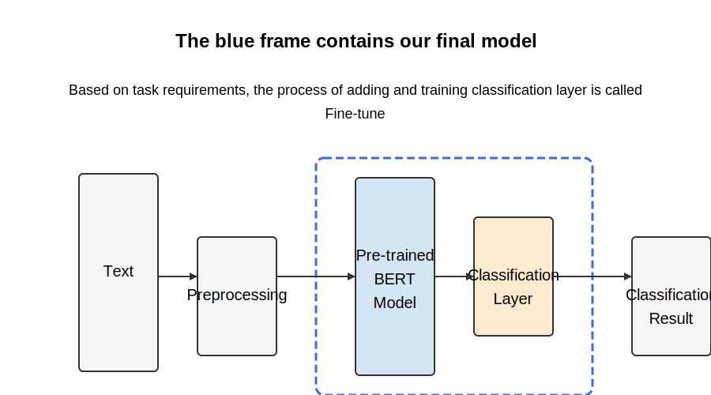
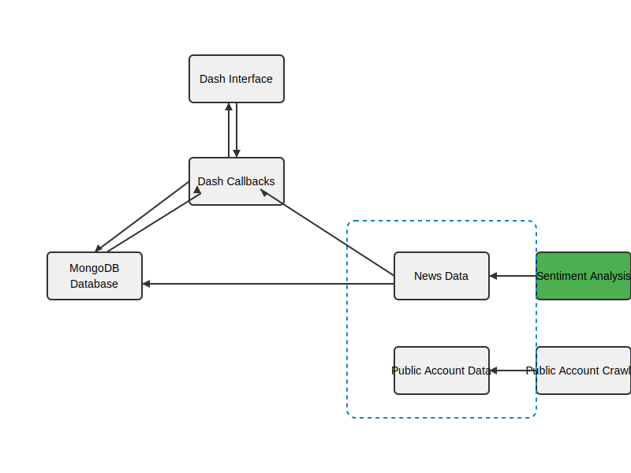

# Financial News Sentiment Analysis System based on BERT

## 1. Overall Introduction

this project achieve the following (finished in Spring 2021)

• Developed Python web scrapers to automatically extract financial news from multiple platforms and label the text as Positive, Neutral, or Negative.

• Built and fine-tuned a classification network based on BERT(pre-trained model) with accuracy over 80% using Keras framwork

• Deployed a visualization website to display model classification results interactively using [Dash](https://dash.plotly.com/dash-core-components).


## 2. Algorithm Introduction


There are different pre-trained Bert models available. When we take these models and train them on our own data, we get our own models. This means that Bert and training models are interchangeable. 


1. **bert_base (Google version)**: https://github.com/google-research/bert
2. **Tiny_bert**
3. **Fin_Bert (Entropy Reduction Technology)**: https://github.com/valuesimplex/FinBERT - For processing financial texts, but feasibility has not been verified
4. **bert_base (iFLYTEK version)**: https://github.com/ymcui/Chinese-BERT-wwm - Larger training data volume, improved training methods! Multiple versions of models are open-sourced and can be used multiple times in the future

### Classification Tasks

If there are multiple text classification tasks, multiple models can be trained to handle individual tasks
### Future Research Directions
The emergence of the Bert model only provides a universal solution for NLP tasks
Because classification tasks differ, different situations may arise. Directly using Bert for training may not solve the problem

## 2. Model Training
### 2.1 Training Data
CSV format

| Text      | Label                 |
| --------- | --------------------- |
| News text | labels are 0, 1, 2... |

### 2.2 Training Environment
**Tensorflow**
**Keras**
**Keras_bert**

### 2.3 Training Process

Training program：Train_model/Train_model.py
Modify parameters

## 3. Model Deployment
### 3.1 Tensorflow Serving

##### Introduction
TensorFlow Serving is a tool introduced by TensorFlow for model deployment. It allows you to quickly deploy your models based on Docker, conveniently iterate versions, and manage containers. Furthermore, TensorFlow Serving is built on C++, eliminating some redundant parameters and designs in model training, allowing your models to run with high performance on CPU/GPU servers. Google itself uses it.
**TF Serving framework, where the yellow box represents the part involved in this project, which is sending the text obtained by the crawler to the model and receiving classification results. Since there is no need to judge the data selected by users, it does not involve data interaction between the client and the Dash framework.**
<a href="https://imgtu.com/i/62atQs"></a>


Checking Status and Shutting Down TF Serving

```shell
sudo docker ps
```

Shut down service (kill the process):

```shell
sudo docker stop ID
sudo docker kill ID
```


### 3.2 Deployment Process
#### 1. Model Format Conversion
Since the model obtained using the above code is a .h5 type file, and TensorFlow Serving deployment requires a different file format, we need to convert the file format here.
Models need a specific file format


#### 2. Save the Converted Model
Run the following code:

```python
pythonfrom keras.models import load_model
from keras_bert import get_custom_objects
model = load_model(model_file, custom_objects=get_custom_objects())
model.save(storage_path, save_format='tf')
```

The currently running model is stored：/Model_deployment/bert/1


#### 3. Start TF Serving Service
```shell
sudo nvidia-docker run -p custom_port:custom_port --mount type=bind,source=tf_format_model_save_path,target=/models/model_name -t --entrypoint=tensorflow_model_server tensorflow/serving:latest-gpu --per_process_gpu_memory_fraction=0.25 --enable_batching=false --model_name=model_name --model_base_path=/models/model_name
```

Here is an example:

```shell
sudo nvidia-docker run -p 8500:8500   --mount type=bind,source=/anaconda3/share/zcl/Model_deployment/bert,target=/models/bert -t --entrypoint=tensorflow_model_server tensorflow/serving:latest-gpu --per_process_gpu_memory_fraction=0.25 --enable_batching=false --model_name=bert --model_base_path=/models/bert
```


### 3.3 Usage
#### 1. Sending Data and Getting Results
The following is the method to update/write request functions when there is a new model

In the terminal under the model storage path, execute the following command:

shellsaved_model_cli show --dir 1/ --all
Below are the results. You need to remember 4 relevant parameters to use in the gRPC request code. Specifically, remember the names in the brackets. For example, the model signature is serving_default. Since the Bert model has two inputs by default, there are two inputs:
<a href="https://imgtu.com/i/62BP6H">
When building the function, you only need to replace the 'send request' part:
pythondef tf_serving_request(text):
    # Data processing part
 ```   python
   def tf_serving_request(text): 
   	maxlen=300
    	text = text[:maxlen]
    	x1, x2 = tokenizer.encode(first=text)
    	X1 = x1 + [0] * (maxlen-len(x1)) if len(x1) < maxlen else x1
    	X2 = x2 + [0] * (maxlen-len(x2)) if len(x2) < maxlen else x2    
    	X1=np.array([X1])
    	X2=np.array([X2])
 
    
 ```

```python
# Send request part

channel = grpc.insecure_channel('localhost:8500') # The custom port number from earlier
stub = prediction_service_pb2_grpc.PredictionServiceStub(channel)
request = predict_pb2.PredictRequest()
request.model_spec.name = "bert"  # Model name, model_name parameter from the startup command
request.model_spec.signature_name = "serving_default"  # Signature name, noted earlier
                                    # "input_1, input_2" are the input names set when exporting the model, noted earlier
request.inputs["input_1"].CopyFrom(
tf.make_tensor_proto(X1,dtype=tf.float32))
request.inputs["input_2"].CopyFrom(
tf.make_tensor_proto(X2,dtype=tf.float32))


# Process results part

response = stub.Predict(request, 5.0)  # 5 secs timeout
result=np.asarray(response.outputs["dense"].float_val) # dense is the output name, noted earlier

y = np.argmax(result) # Determine the maximum one
score=max(result)
if y==0:
    class_="Positive"
elif y==2:
    class_ ="Negative"
elif y==1:
    class_ ="Neutral"
    
return class_ , round(score,5)        
```

Reference: https://zhuanlan.zhihu.com/p/96917543

### 2. Application in Dash Project
Crawler Obtaining Data for Sentiment Classification
As shown in the figure, the green part is the algorithm deployed using TensorFlow Serving
<a href="https://imgtu.com/i/62yBRK"></a>
Related Python files:

cls_crawler.py - getNewsDetail
wall_crawler.py - getNewsDetail

#### Getting Historical News Data
The process flow is the same as above, but it only performs database operations without displaying on the frontend. Related file: mongo/cls_mongo.py